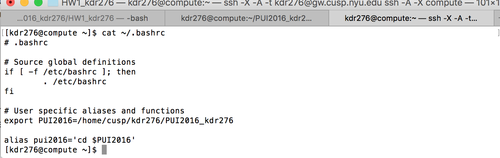
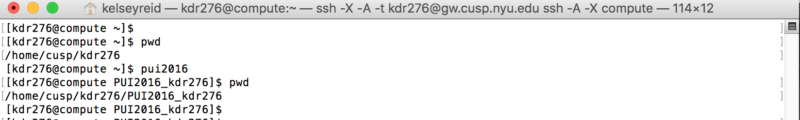

# PUI 2016 HW 1 - Kelsey Reid

## Assignment One - Finishing Lab:

Worked with Matt Sloane to complete the fork neighbor's repo exercise from his gittest_ms9548 repository

Worked with Will Xia to complete the fork neigbor's repo exercise from his gittest_wbx200 repository

##Assignment Two - Setting Up the Environment:

On compute I was able to create a variable PUI2016 in the command line with export PUI2016='home/cusp/kdr276/PUI2016_kdr276' which returns the path to a created directory, PUI2016_kdr276. To save the variable I did the following: echo 'export PUI2016='home/cusp/kdr276/PUI2016_kdr276'' >> ~/.bashrc 
I then created the alias pui2016 with alias pui2016='cd $PUI2016' and saved it in the same with echo and >> ~/.bashrc

I confirmed the variable and alias saved in .bashrc by ensuring I was in my home directory and then entering nano .bashrc where both items were saved under "user specific aliases and functions". Below is a screenshot of the same:

I opened a new terminal tab to log back into computer and confirmed the variable and alias saved and still executed as desired. Typing the commands pwd, pui2016, pwd into the terminal resulted in the below screenshot:

